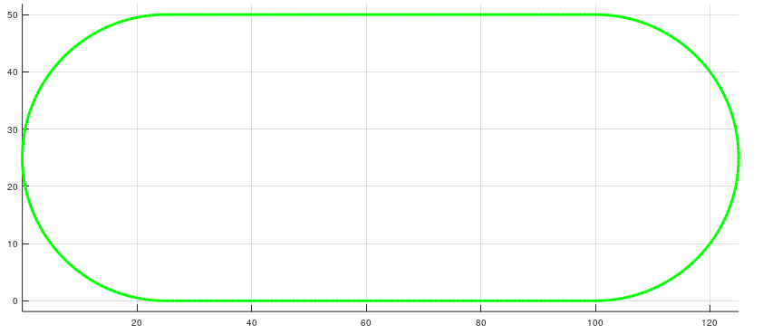
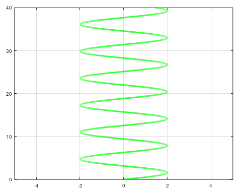
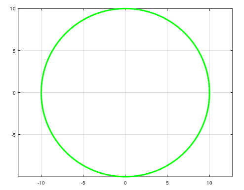
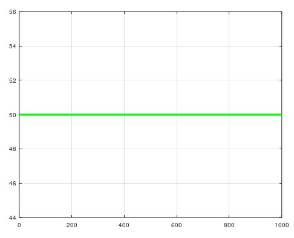

# Model of 2 wheeled Line Following Robot
To use:
* [runsim.m](runsim.m) is the main script. Robot, sensor and controller attributes are edited here, as well as the simulation loop, and any plotting. To use this simulation, edit and run this script.
* [Contoller.m](Controller.m) is the class for the PID controller
* [DDR.m](DDR.m) is the class used to calculate differential drive vehicle kinematics
* [IR_sensor.m](IR_sensor.m) is the class used to sense where the robot is relative to the track
* [LineConstruct.m](LineConstruct.m) is the class used to build the track for the robot to follow 

## **Required Attributes:**
**Robot Attributes**
* Robot Base speed (cm/s)
* Wheel Radius of robot (cm)
* Track width of robot (cm)
* Starting Position of robot (cm)

**Sensor Attributes**
* Width of Sensor (cm)
* Distance of sensor from the robot (cm)

**Controller Attributes**
* Kp (Proportional Gain)
* Ki (Integral Gain)
* Kd (Derivative Gain)
* Controller Set Point
* Saturation Limits

## **Line Types**
There are multiple built in tracks for the line follower model to use, but it is reccomended to use the Line track for tuning the robot:

Track:

Sine:

Circle:

Line: 

